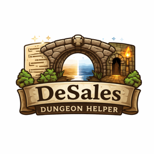

<p align="center">
  
</p>

<h1 align="center">DeSales Dungeon Helper</h1>

<p align="center">
  <strong>Procedural dungeon generation for MonoGame</strong>
</p>

<p align="center">
  <a href="https://github.com/JohnVonDrashek/desales-dungeon-helper/actions/workflows/ci.yml"></a>
  <a href="https://www.nuget.org/packages/DeSales.DungeonHelper/"></a>
  <a href="https://opensource.org/licenses/MIT"></a>
</p>

---

Define dungeons in human-readable YAML, generate with deterministic seeds, and export to Tiled-compatible TMX files. Perfect for roguelikes, dungeon crawlers, and any game that needs procedurally generated levels.

## Features

- **YAML Configuration** - Define dungeon layouts in simple, readable YAML files
- **Deterministic Generation** - Same seed always produces the same dungeon
- **TMX Export** - Output compatible with [Tiled Map Editor](https://www.mapeditor.org/)
- **Room Types** - Spawn rooms, boss rooms, treasure rooms, and custom types
- **Automatic Corridors** - Connects rooms with configurable corridor styles
- **Runtime Helpers** - Query spawn points, room bounds, and collision rectangles in your game

## Installation

```bash
dotnet add package DeSales.DungeonHelper
```

## Quick Start

**1. Create a YAML config file:**

```yaml
dungeon:
  name: my_dungeon
  seed: 12345
  width: 50
  height: 50

rooms:
  count: 8-12
  types:
    spawn:
      count: 1
      size: 7x7 to 10x10
    boss:
      count: 1
      size: 15x15 to 20x20
      placement: far_from_spawn
    standard:
      count: rest
      size: 5x5 to 12x12

corridors:
  style: winding
  width: 1

tiles:
  floor: 1
  wall: 2
  door: 3
```

**2. Generate and save the dungeon:**

```csharp
using DeSales.DungeonHelper;

// Load config and generate
var config = DungeonConfig.LoadFromFile("dungeon.yaml");
var map = DungeonGenerator.Generate(config);

// Save as TMX for Tiled, or use directly in your game
map.Save("output.tmx");
```

**3. Use runtime helpers in your game:**

```csharp
// Get player spawn position
Vector2 playerStart = map.GetSpawnPoint("PlayerSpawn");

// Get all treasure locations
var treasures = map.GetSpawnPointsByType("treasure");

// Get wall collision rectangles for physics
var walls = map.GetCollisionRectangles("Tiles", wallTileId: 2);
```

## Example Output

```
##################################################
#...............#................................#
#...............#................................#
#...............#................................#
#...............#................................#
#.....[@]......##...........[B]..................#
#...............#................................#
#...............####.............................#
#...............#  #.............................#
#####.###########  ##########.###################
#   #.#                     #.#                 #
#   #.#                     #.#                 #
#   #.#######################.#                 #
#   #.........................#                 #
#   #.#######################.#####.#############
#   #.#                     #.....#.#
#   #.#   ###################+#####.#############
#   #.#   #..................#......#...........#
#####.#####..................#......#...........#
#.....#    #.................[T]....#...........#
#.....#    #.................#......#...........#
##################################################

[@] = Player Spawn    [B] = Boss Room    [T] = Treasure
```

## Documentation

For detailed guides, see the [Wiki](https://github.com/JohnVonDrashek/desales-dungeon-helper/wiki):

- [Getting Started](https://github.com/JohnVonDrashek/desales-dungeon-helper/wiki/Getting-Started) - Installation and first dungeon
- [Configuration](https://github.com/JohnVonDrashek/desales-dungeon-helper/wiki/Configuration) - Complete YAML reference
- [TMX Output](https://github.com/JohnVonDrashek/desales-dungeon-helper/wiki/TMX-Output) - Understanding the generated files
- [Runtime Helpers](https://github.com/JohnVonDrashek/desales-dungeon-helper/wiki/Runtime-Helpers) - Using maps in your game
- [API Reference](https://github.com/JohnVonDrashek/desales-dungeon-helper/wiki/API-Reference) - Full API documentation
- [Examples](https://github.com/JohnVonDrashek/desales-dungeon-helper/wiki/Examples) - Complete working examples

## Using with Claude Code

If you're using [Claude Code](https://claude.ai/code) to build your game, copy the [CLAUDE.md template](docs/CLAUDE.md.template) to your project root. This instructs Claude to use this library for dungeon generation instead of writing custom code.

## Requirements

- .NET 10.0 or later
- MonoGame 3.8.2 or later (for runtime helpers)

## Building from Source

```bash
git clone https://github.com/JohnVonDrashek/desales-dungeon-helper.git
cd desales-dungeon-helper
dotnet build
dotnet test
```

## License

MIT License - see [LICENSE](LICENSE) for details.

## Contributing

Contributions welcome! Please open an issue or pull request.
